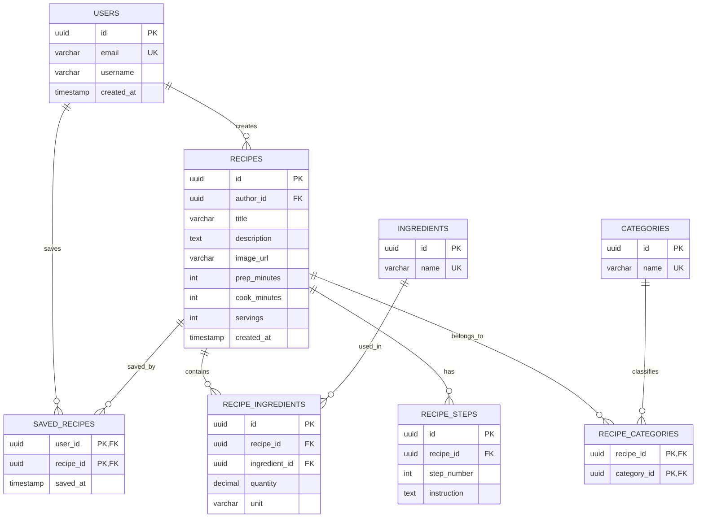

```mermaid
erDiagram
USERS ||--o{ RECIPES : creates
USERS ||--o{ SAVED_RECIPES : saves
RECIPES ||--o{ SAVED_RECIPES : saved_by
RECIPES ||--o{ RECIPE_INGREDIENTS : contains
INGREDIENTS ||--o{ RECIPE_INGREDIENTS : used_in
RECIPES ||--o{ RECIPE_STEPS : has
RECIPES ||--o{ RECIPE_CATEGORIES : belongs_to
CATEGORIES ||--o{ RECIPE_CATEGORIES : classifies

    USERS {
        uuid id PK
        varchar email UK
        varchar username
        timestamp created_at
    }

    RECIPES {
        uuid id PK
        uuid author_id FK
        varchar title
        text description
        varchar image_url
        int prep_minutes
        int cook_minutes
        int servings
        timestamp created_at
    }

    INGREDIENTS {
        uuid id PK
        varchar name UK
    }

    RECIPE_INGREDIENTS {
        uuid id PK
        uuid recipe_id FK
        uuid ingredient_id FK
        decimal quantity
        varchar unit
    }

    RECIPE_STEPS {
        uuid id PK
        uuid recipe_id FK
        int step_number
        text instruction
    }

    CATEGORIES {
        uuid id PK
        varchar name UK
    }

    RECIPE_CATEGORIES {
        uuid recipe_id PK,FK
        uuid category_id PK,FK
    }

    SAVED_RECIPES {
        uuid user_id PK,FK
        uuid recipe_id PK,FK
        timestamp saved_at
    }
```
